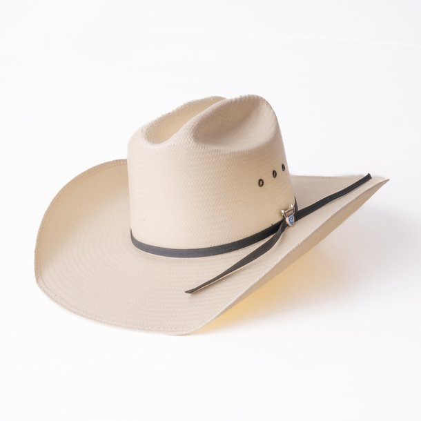
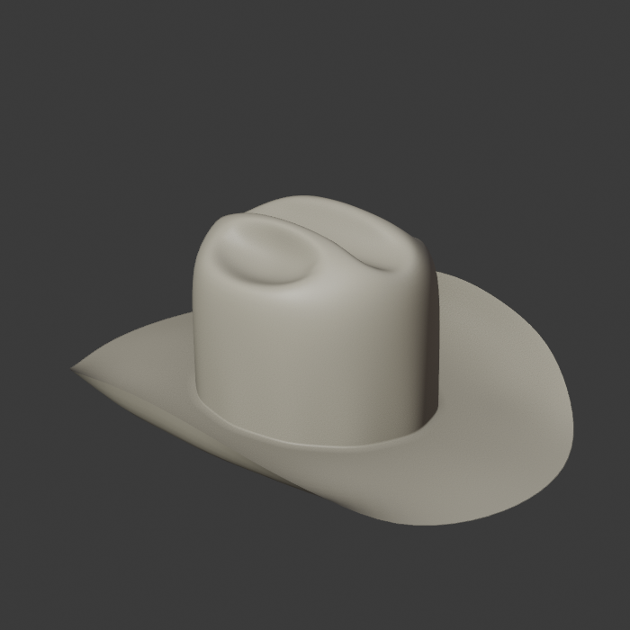
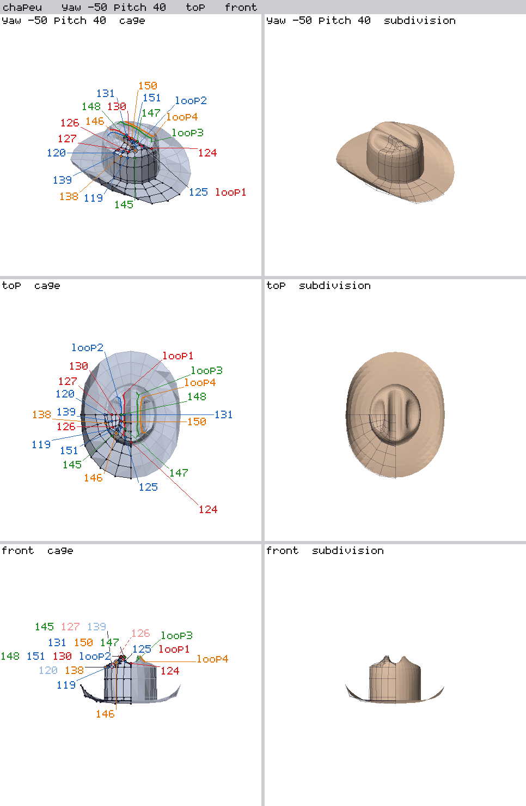

# Fofuxo Modeling Rules

> [!TIP]
> English version → [README.md](README.md) (under construction)

As ferramentas e as etapas para que uma LLM de texto, como o Claude, consiga
modelar no Blender: uma skill com as regras e o passo a passo de um modelador
humano (ler o concept, planejar, construir por etapas, conferir), e uma
extensão do Blender que dá à LLM as ferramentas do próprio Blender por texto
e a deixa trabalhar em dupla com o modelador, que revisa, corrige e ensina.

## Sumário

- [Objetivo](#objetivo)
- [Exemplo: um chapéu de cowboy](#exemplo-um-chapéu-de-cowboy)
- [Como funciona](#como-funciona)
  - [A skill](#a-skill)
  - [A extensão LLM Modeling Bridge](#a-extensão-llm-modeling-bridge)
  - [O ciclo com o modelador](#o-ciclo-com-o-modelador)
- [Estrutura](#estrutura)
- [Estado atual](#estado-atual)
- [Roadmap](#roadmap)
- [Convenções](#convenções)
- [Por que existe](#por-que-existe)

## Objetivo

É uma proposta diferente da de geradores como o Tripo. O Tripo entrega o
modelo final pronto, sem nenhuma informação de como ele foi feito. Aqui a
IA segue as etapas reais de um modelador (o cilindro inicial, os loops, a
pilha de modifiers, os ajustes), e o resultado é um modelo feito pelo
processo convencional e humano de modelagem, que um modelador abre e edita
com facilidade.

Que uma IA modele como um modelador experiente: que entenda a forma de um
concept (onde é maior, onde é menor, onde curva), escolha o caminho de
construção, use as ferramentas do Blender em vez de scripts, e entregue uma
malha que faça sentido tanto em low poly quanto com Subdivision.

O caminho é aprender com o uso: cada correção do modelador vira uma regra,
uma técnica ou uma ferramenta, e cada rodada nova deve precisar de menos
explicação que a anterior.

## Exemplo: um chapéu de cowboy

O primeiro modelo feito do zero com o método: um chapéu de palha, a partir
de uma foto em 3/4, modelado por etapas na conversa com o Claude, com o
modelador corrigindo a cada render e mostrando no Blender as partes mais
difíceis (as três depressões do topo). Em andamento.

| referência | resultado (Workbench) |
|---|---|
|  |  |

A ficha que a LLM usa para ver o modelo: o cage à esquerda, com só os
vértices e loops da etapa rotulados, e o resultado com Subdivision à
direita.



## Como funciona

### A skill

`skill/fofuxo-modeling-rules/SKILL.md` é o que a IA lê antes de modelar. O
fluxo:

1. Carregar a biblioteca e ler a cena (concept, corpo onde a peça se apoia,
   nomes, coleções).
2. Ler o concept em camadas: silhueta, formas internas, formas escondidas, o
   que o 3D precisa, as outras vistas; numa foto em perspectiva, a forma e
   não os pixels.
3. Escrever o plano (`plan.md`) e, com um humano na sessão, esperar o OK.
4. Construir por etapas: fechar cada região com o mínimo de faces, dar forma
   em passos pequenos conferidos, usar as ferramentas de arrumar (LoopTools
   Circle e Space, slides), desfazer quando não deu certo.
5. Olhar, auditar e entregar com um relatório e a linha de custo.

### A extensão LLM Modeling Bridge

Uma extensão do Blender (`extension/fofuxo_cage/`, com o
[README próprio](extension/fofuxo_cage/README.md), em inglês) que faz a ponte
entre a IA e o Blender:

- **O cage como texto**: `<arquivo>.cage/<objeto>.txt`, com ids estáveis por
  vértice, loops, faces, modifiers e tamanhos; editar o texto e sincronizar
  move a malha, e o que o humano muda no Blender volta para o texto.
- **Operadores do Blender por linha** (`mesh`, `add`, `set`, `crease`...),
  com uma lista fechada de operadores, seleção por id, loop, ring, região ou
  marca, e uma checagem em cópia antes de cada operação (quads, planos de
  Mirror, sem geometria solta).
- **Peças novas** (`start_part`) com Mirror e Subdivision já na ordem certa.
- **Fichas de render** desenhadas na CPU (frente, topo, lado e vistas
  livres), com o concept ao lado.
- **Dois Blenders**: o da IA e o da revisão humana, com gravador de comandos.

### O ciclo com o modelador

1. A IA planeja ou constrói uma etapa e mostra o render.
2. O modelador corrige por texto (o método vira regra) ou edita no Blender
   de revisão (a forma); marcas apontam loops e regiões.
3. A IA importa a edição, lê os comandos gravados, diz o que entendeu e
   registra a regra no `DECISIONS.md`.
4. Regras que mudam todo plano vão para a skill; formas que se repetem viram
   técnicas em `models/TECHNIQUES.md`.

## Estrutura

```
skill/fofuxo-modeling-rules/   a skill (SKILL.md) e o modelo de plano (PLAN.md)
extension/fofuxo_cage/         extensão do Blender: cage como texto, operadores, revisão
models/
  FEEDBACK.md                  como entrevistas e feedback viram regras
  TECHNIQUES.md                técnicas com nome, pela forma que resolvem
  example/                     exemplos humanos (arquivos do modelador, medidas, técnicas)
  tasks/<nome>/                um desafio e as tentativas
    start.blend                arquivo inicial, concept empacotado
    prompt.md, target.md       o pedido e as metas
    ai/                        rodadas de IA, uma pasta por rodada
    human/                     trabalho humano na tarefa
DECISIONS.md                   cada regra, o porquê e de onde veio
ROADMAP.md                     o que construir a seguir
```

## Estado atual

- **Exemplos**: o laço e o chapéu do dragãozinho (E1) e os babados da saia.
- **Tarefas**: `laco` (T1, rodadas Sonnet e Opus com e sem regras),
  `chifre` (T2, teste de transferência, dois pares julgados) e
  `chapeu-cowboy` (o plano revisado e a modelagem por etapas na conversa,
  rodada C1, em andamento; resumo em
  `models/tasks/chapeu-cowboy/HANDOFF.md`).
- **Regras**: D-001 a D-079 no `DECISIONS.md`.

## Roadmap

O que vem a seguir está no [ROADMAP.md](ROADMAP.md) (em inglês).

## Convenções

- **Ids.** `E<n>` é um exemplo humano, `T<n>` um teste de IA, como citados no
  `DECISIONS.md`. Nomes de pasta em ASCII (`laco`, não `laço`).
- **Rodadas.** `tasks/<nome>/ai/<rodada>/`, cada uma com o `plan.md`, o
  `.blend`, o texto do cage e um `report.md` com modelo, prompt, tempo,
  tokens, medidas e veredito.
- **Saída da IA e edição humana separadas.** Quando o modelador edita um
  resultado da IA, a rodada guarda o arquivo da IA e a edição vai para
  `human/`.
- **Texto do cage.** Vai para o repositório (cada iteração é um diff
  legível); a pasta `.state/` e os arquivos de sessão da revisão não vão.
- **Mover um .blend.** Abrir e dar Save As com remap relativo; um `git mv`
  simples quebra os links de assets quando a profundidade da pasta muda.
- **Nunca salvar por cima** de arquivos de `example/` ou de rodadas
  terminadas; trabalhar numa cópia.
- **Termos do Blender em inglês**: vertex, edge, face, Mark Seam,
  Subdivision, Solidify.

## Por que existe

A skill começou de um arquivo humano (E1) e de uma pergunta: do que uma IA
precisa para modelar como esse modelador? O teste T1 mostrou que os modelos
erram mais na execução do que na percepção, e daí veio a extensão LLM
Modeling Bridge (D-048). As rodadas dos chifres (T2) mostraram que o método errava antes
da forma e que achar comandos por tentativa custava caro, e daí veio o plano
revisado antes de modelar (D-065). No chapéu de cowboy o método mudou de
novo: modelar por etapas, com o modelador corrigindo no meio, e aprender
olhando o modelador trabalhar.
